# Add New VM Template

## Table of Contents

- [Changelog](#Changelog)
- [Introduction](#Introduction)
- [Purpose](#Purpose)
- [Scope](#Scope)
- [Steps](#Steps)
- [Prerequisites](#Prerequisties)
- [Template validation in vcenter](#Template-validation-in-vcenter)
- [Infrastucture(Image Mapping) in vRA](#Infrastucture(Image-Mapping)-in-vRA)
- [Apply Image in Blueprint](#Apply-Image-in-Blueprint)

## Changelog
  
| Version | Date       | Description      | Author       |
| ------- | ---------- | ---------------- | -------------|
| 0.1     | 27/09/2022 | Adding New VM Template In ANS-MAR & CLY  | Pardeshi Kanchan |

## Introduction

### Purpose
   
   The purpose of this document is to create step by step instructions for adding New VM Template in blueprints as per customer request.
### Scope

   Adding New VM Template in both ANS-MAR & ANS-CLY Environment. Notes- Customer may request addition of new VM Template in one site or both the sites.
   
## Steps

   There are three steps We need to perform-
   
   1. Template validation in vcenter
   
   2. Infrastucture(Image Mapping) in vRA
   
   3. Apply Image in Blueprint
   
## Prerequisites

  Prerequisites to Add New VM Templae.

  1. Access to respective tenants (eg-ans-mar-01 , ans-cly01) in VRA.
  
## Step 1

## Template validation in vcenter

- Step 1.1

  - Customer should make new vm template available in vcenter. 
    
- Step 1.2

  - All the changes or modifition to the template will be in customer scope.
    
- Step 1.3

  - Root password on the template should be same as for the existing template.

## Step 2

## Infrastucture(Image Mapping) in vRA

- Step 2.1
    
    - For Adding new VM template in Blueprint, Log on to VRA Cloud Assembly.
 
 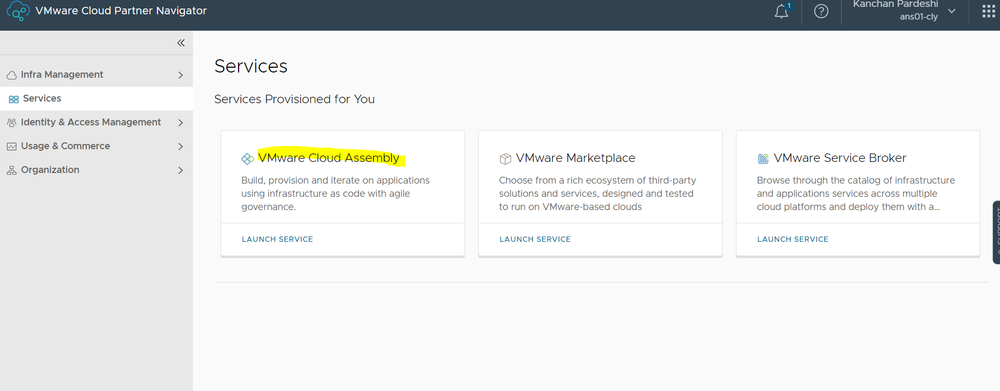
 
- Step 2.2

    - For mapping of Image, Select Infrastucture
     
    - Click on Image Mapping, And Add new image mapping
    
 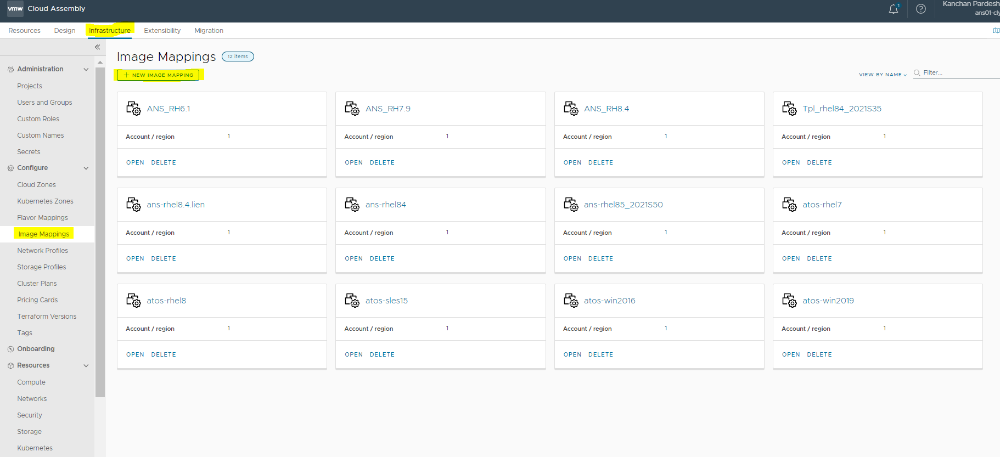
 
- Step 2.3

    - Give the Image Name and in Configuration select the region where image is availble and then in image we should select perticular image. 
    
    - Click on create 
    
 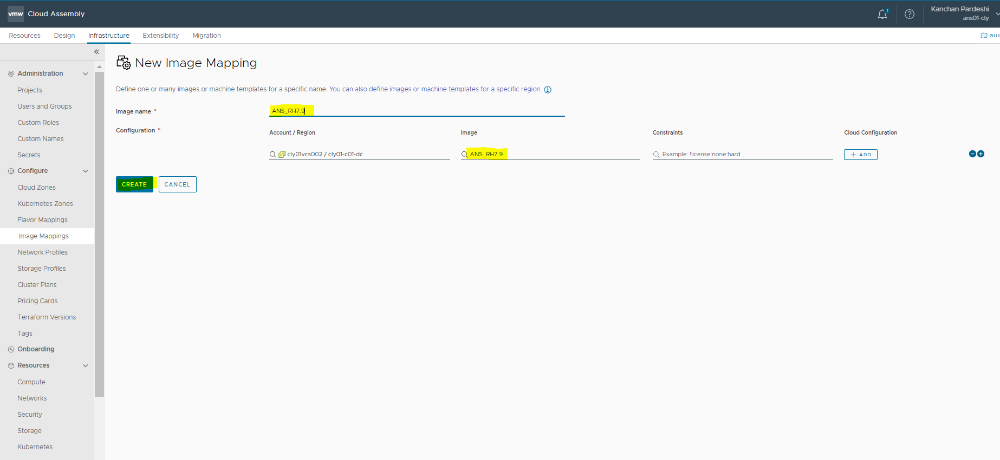
 
- Step 2.4

    - After Creation it will be visible in Image Mapping 

 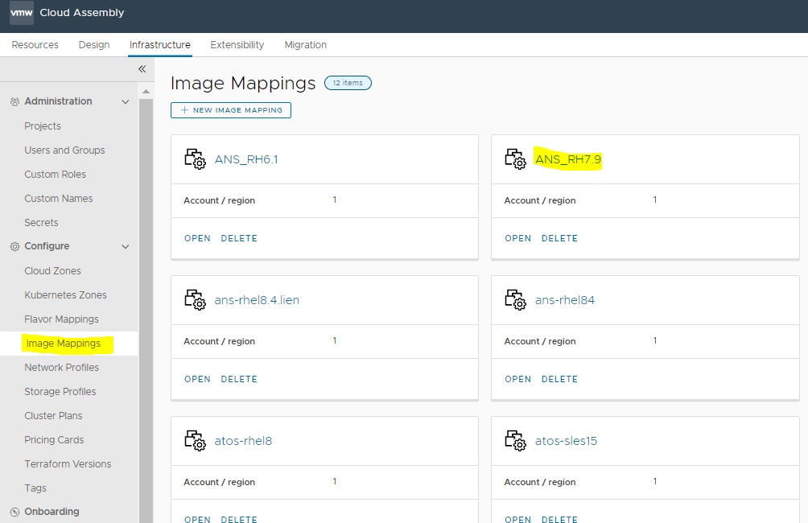
 
## Step 3

## Configure Image in Blueprint

 - Step 3.1

    - To Configure Image go to Design, and select your blueprint and Add New image mapping under image variable.
    
 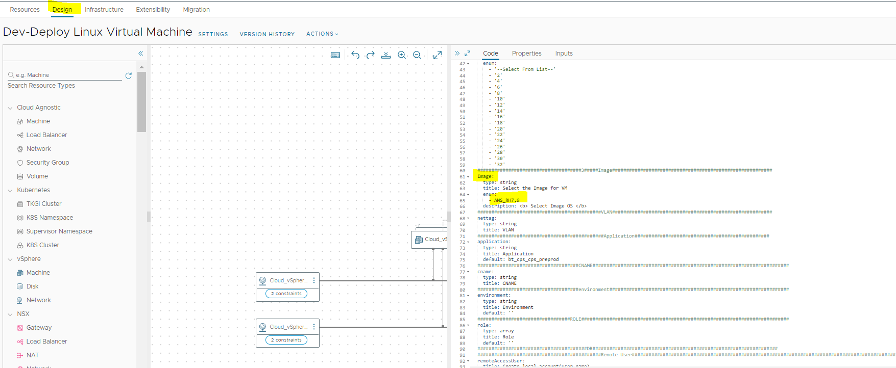
 
 - Step 3.2
 
    - Once bluprint is ready just go to Actions and Clone it 
    
 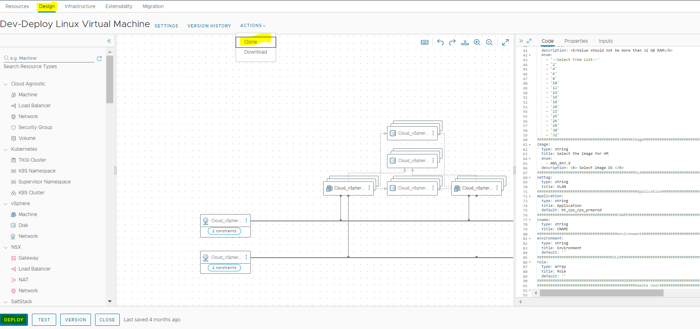
 
 - Step 3.3

    - Give the Name to cloned Blueprint After that select project 
    
    - Click on Clone
    
  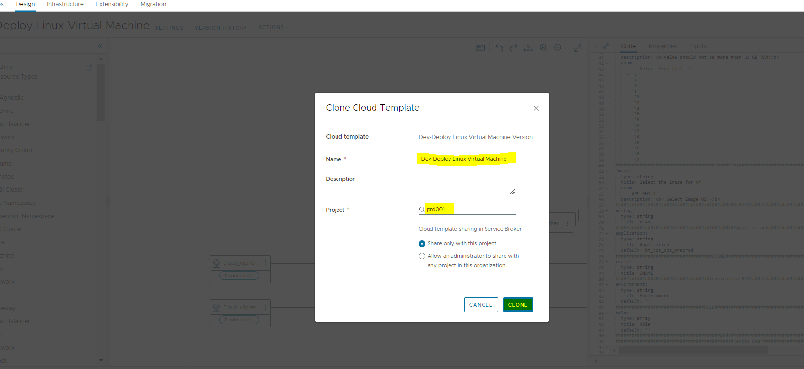
  
  - Step 3.4
  
    - Once Successfully Clone, then go to service broker 
    
  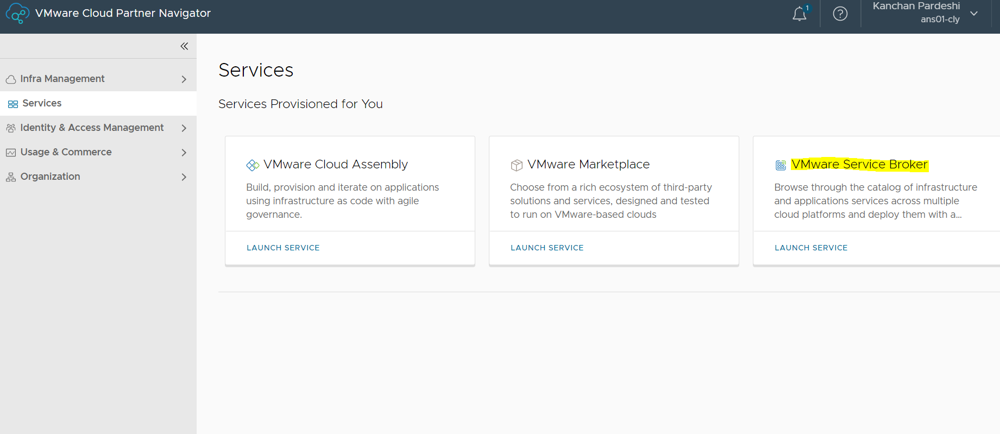
  
  - Step 3.5
  
    - Click on Content & Policies, then go to Content Sources
    
  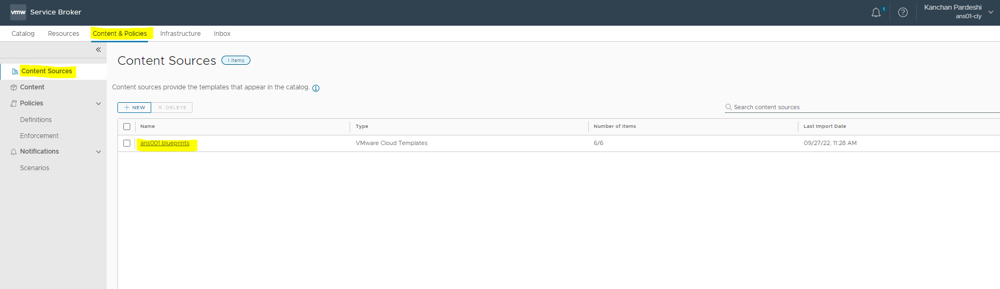
  
  - Step 3.6
  
    - Just Validate it once and then Save & Import
    
  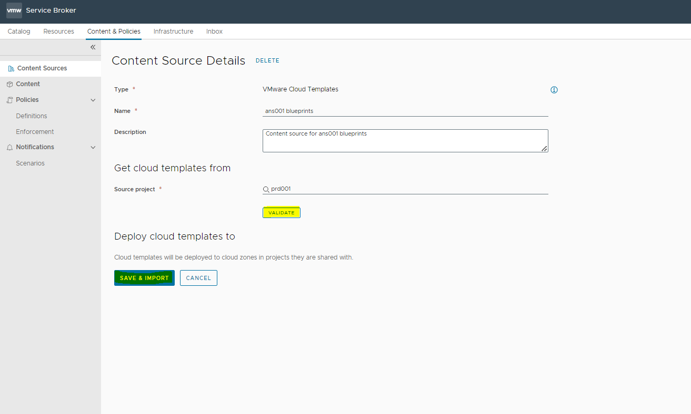
  
  - Step 3.7
  
    - Once it gets Validated then go to catalog and open catalog for which was clone by the given name and then we will be able to see image in that catalog
    
    - Once done with all process once deploy once and check whether its working properly
    
  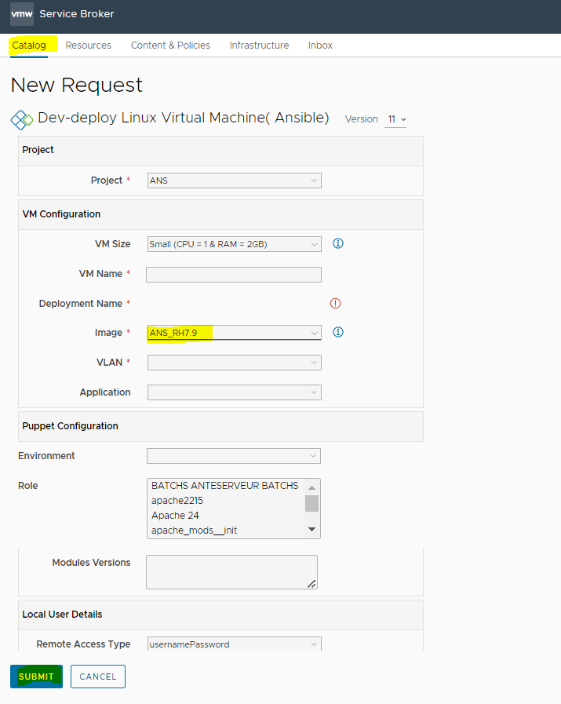
  
## Note

  - Once proper testing has to be done for vm provisioning using that template in DEV blueprint only

  - If all testing are ok, then only that tempalte can be made available in PRD blueprint..
  
  - Without end to end testing of new template in DEV blueprint it cant be deployed in PRD blueprint

 
  

      

